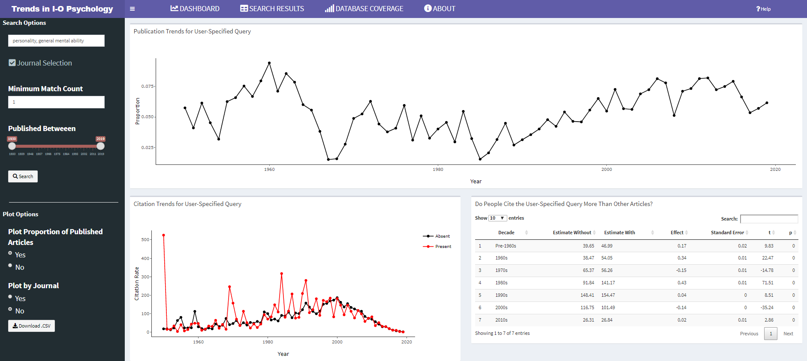
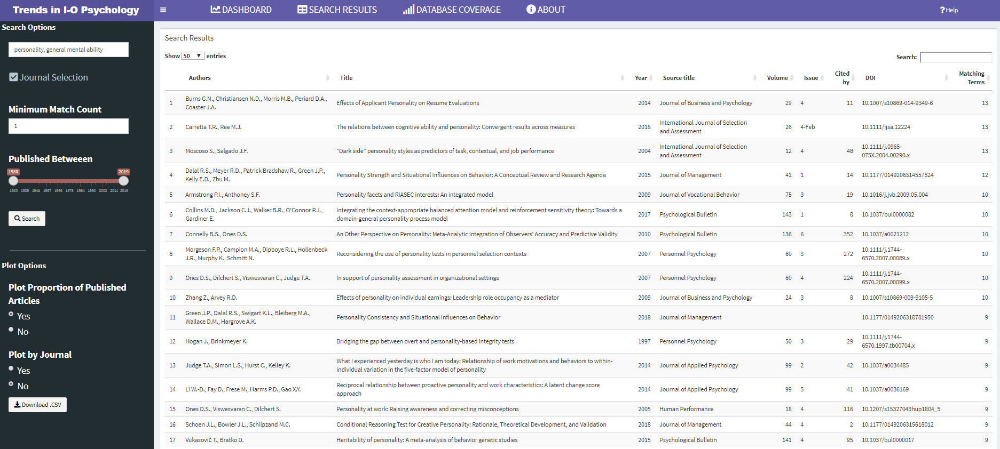
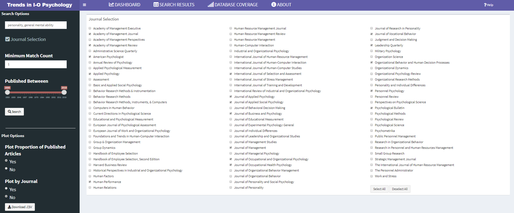

## Trends in Industrial-Organizational Psychology
As scientists search for new insights into the world of work, topics inevitably fall in and out of vogue.  Perhaps the most volatile and well recognized swings in research interests have been observed in personality research.  Walter Mischel's 1968 book *Personality and Assessment* came to the gloomy conclusion that "[w]ith the possible exception of intelligence, highly generalized behavioral consistencies have not been demonstrated, and the concept of personality traits as broad response predispositions is thus untenable."  After this book was published, personality research for selection and assessment slowed considerably until about a decade later.  Identifying these trends (and slumps) can help researchers and practitioners see where the field is headed, where it has been, and identify ideas and topics that should be brought to light once again. 

This app was designed to help researchers and practitioners identify current trends in industrial-organizational psychology.  It uses user-defined queries to search article abstracts in I-O psychology's top scientific journals.  Search results are plotted over time, and users have the option to focus on specific (or all) journals, and download a .csv file of their generated data.  Additionally, search results are used to predict citation rates across the decades.  Feel free to download and adapt the app to your needs, or submit a request and we will see if we can help.

## System Requirements
In addition to R and R Studio, this app depends on the following packages:

    1. shiny
    2. rintrojs
    3. shinydashboard
    4. tidyverse
    5. tidytext
    6. plotly
    7. knitr
    8. shinycssloaders
    9. shinyjs
    10. DT


Dependencies can easily be installed and loaded by running the following code.

```{r, eval = FALSE}
source("https://raw.githubusercontent.com/jimmyrigby94/trends_in_IO/master/install_dependencies.R")
```

## How to Run
To run the app without downloading the repository, simply run the following code from your console.

```{r, eval=FALSE}
shiny::runGitHub("trends_in_IO", username = "jimmyrigby94")
```

Alternatively, you can download the repository and run the following code.

```{r, eval=FALSE}
# First clone the repository with git. If you have cloned it into
# ~/shiny_example, first go to that directory, then use runApp().
setwd("~/shiny_example")
runApp()
```

## What's New? 

### April 2020

- Updated database
- Bug fixes


## Future Improvements
- Action buttons that quickly select a subcategory of journals (i.e., Research Methods, OHP)
- Identification of emerging subtopics related to search
- Implementation of TF-IDF ranking
- Outlet recommendations

## Screenshots








## Old Change Logs

### February 2024
- Bug fix in author filter
- Migrated data from SCOPUS to semantic scholar

### February 2020
- Updated and simplified UI
- Added intro.js Tutorial
- Made cite-pred robust to null search results
- Corrected errors

### January 2020
- Significant speed improvements
- Reorganization of internals
- Action button for new search
- Correcting a few errors

### October 2019

- Action buttons that quickly select and deselect all journals
- Complete overhaul of UI
- Refinement of visualizations

### September 2019
- Expanded the database coverage to include more than 30 new journals
- Included visualizations of citation rates
- Implemented data import using vroom for increased speed
- Updated UI
- Aesthetic improvements
- Code improvements and clarity