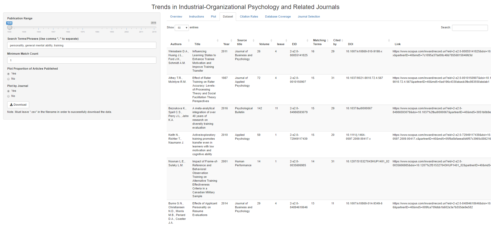

Trends in IO Psychology
================

## Trends in Industrial and Organizational Psychology

As scientists search for new insights into the world of work, topics
inevitably fall in and out of vogue. Perhaps the most volatile and well
recognized swings in research interests have been observed in
personality research. Walter Mischel’s 1968 book *Personality and
Assessment* came to the gloomy conclusion that “With the possible
exception of intelligence, highly generalized behavioral consistencies
have not been demonstrated, and the concept of personality traits as
broad response predispositions is thus untenable”. After this book was
published, personality research for selection and assessment slowed
considerably until about a decade later. Identifying these trends (and
slumps) can help researchers and practitioners see where the field is
headed, where it has been, and identify ideas and topics that should be
brought to light once again.

This app was designed to help researchers and practitioners identify
current trends in industrial and organizational psychology. It uses user
defined queries to search article abstracts in the IO psychology’s top
scientific journals. Users are provided with a plot of trends over time
with options to focus on specific journals, a downloadable .csv file,
and a regression results using the user’s search term to predict
citation rate across the decades. Feel free to download and adapt the
app how you see fit or submit a request and I will see if I can help.

## How to Run

To run the app without downloading the repository, simply run the
following code.

``` r
shiny::runGitHub("trends_in_IO", username = "jimmyrigby94")
```

Alternatively, you can download the repository and run the following
code.

``` r
# First clone the repository with git. If you have cloned it into
# ~/shiny_example, first go to that directory, then use runApp().
setwd("~/shiny_example")
runApp()
```

## System Requirements

In addition to R and R Studio this app depends on the following
packages:

    1. shiny
    2. tidyverse
    3. tidytext
    4. plotly
    5. knitr

## Screenshots

  
 
